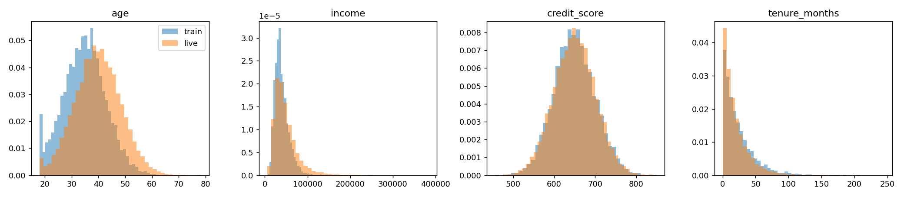
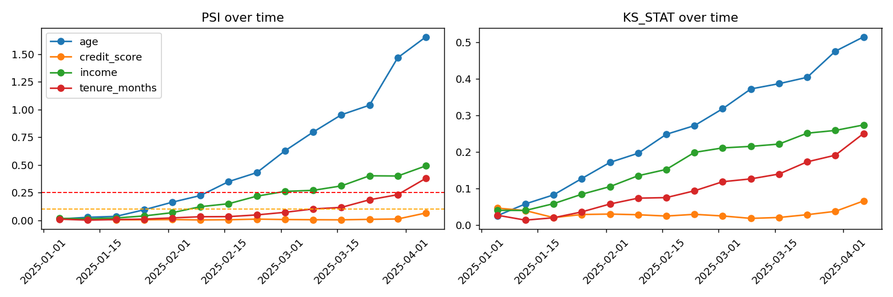
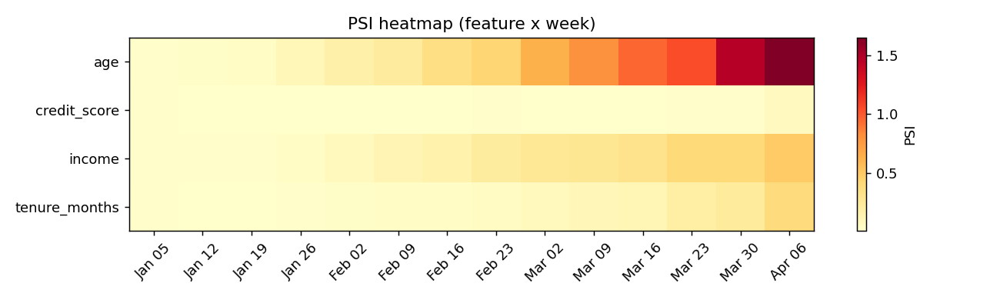
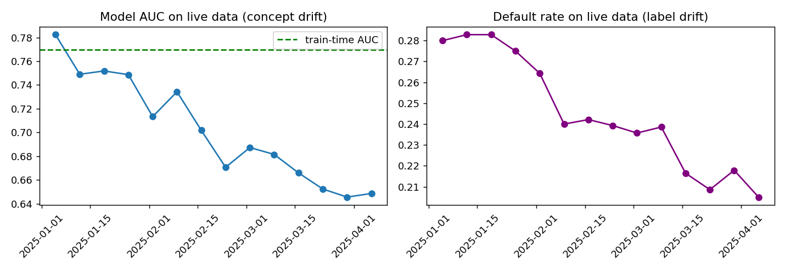

# Data Drift Monitor

Detect and track data drift between training data and live (production) data using **PSI** and the **Kolmogorov-Smirnov test**, with visuals showing how drift evolves over time.

## Why this matters
Models degrade silently when live data stops looking like training data. This project shows how to catch that early.

## Metrics
| Metric | Meaning | Rule of thumb |
|---|---|---|
| PSI | Population Stability Index | <0.1 stable, 0.1-0.25 moderate, >0.25 significant |
| KS | Max gap between two CDFs | p-value < 0.05 flags drift |

## Project structure
```
data/      train.csv, live.csv (synthetic), generated reports
src/       drift.py (metrics), plots.py (visuals), generate_data.py
figures/   distributions, drift over time, PSI heatmap
tests/     unit tests for PSI
run.py     runs the full analysis
```

## Quick start
```bash
pip install -r requirements.txt
python -m src.generate_data
python run.py
pytest
```

## Data
Synthetic credit-style data. In `live.csv`, drift is built in and grows over 90 days:
`age` (mean shift), `income` (shift + wider spread), `tenure_months` (shrinking), while `credit_score` stays stable as a control.

## Results




## Data drift vs concept drift
| Type | What changes | How we detect it | Needs target? |
|---|---|---|---|
| Data (covariate) drift | P(X) | PSI, KS per feature | No |
| Label drift | P(y) | Target rate over time | Yes |
| Concept drift | P(y given X) | AUC decay + retrain-gap test | Yes |

In the synthetic data, `age`, `income`, `tenure_months` have data drift. `credit_score` has **no data drift but does have concept drift**: it slowly stops predicting default. PSI/KS miss this, performance monitoring catches it.



## Next steps
Categorical features (chi-square), Evidently comparison, Slack/email alerts, a FastAPI endpoint, and a scheduled GitHub Action.
